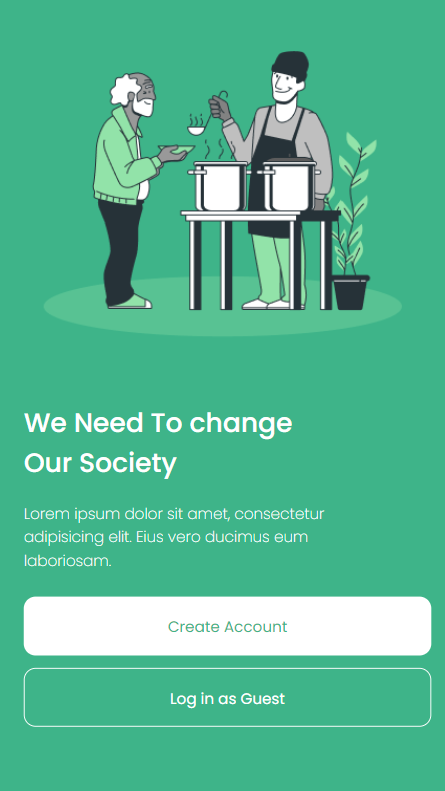
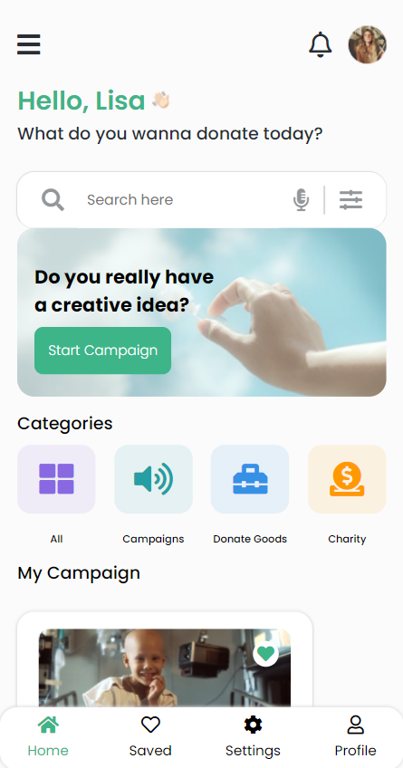
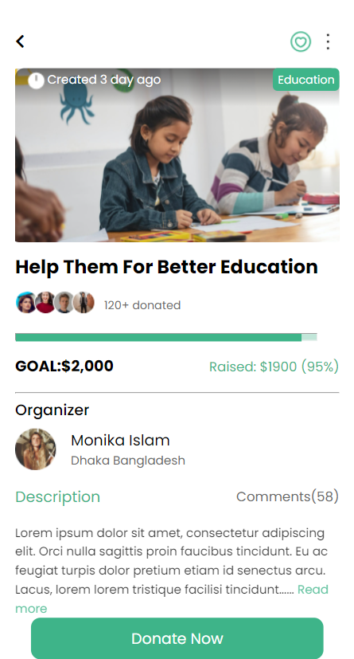
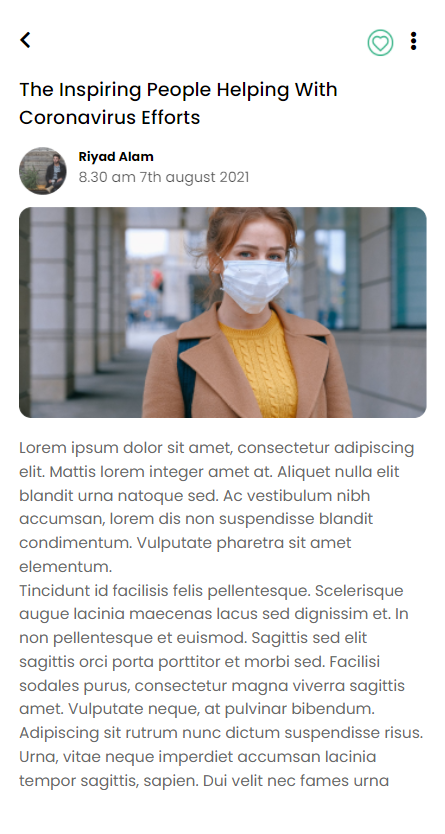

# Donation App

## Check it out [here](https://gsg-cf05.github.io/DonationApp-Team-4/)

---

## Team Members

- [Basel Al-sheikh](https://github.com/Bas-Shiekh)
- [Omar Abu Rabie](https://github.com/omaraburabie3)
- [Bakeza Diazada](https://github.com/Bakeza)
- [Sara Dahman](https://github.com/SaraDahman)

---

## What is Donation App?

It's a mobile application specified for donations in order to help those in need. Using the app, You can either donate money, or start a campaign to collect money and goods for others.

---

## Why did we create it?

We created this App as a practice project for GSG Coding Foundation course. Its purpose is to practice and improve our HTML and CSS skills in addition to working in a team environment.

---

## How to use the App:

- When you first open it, you can either create an account or join as a guest.
- If you create an account, you can start donation campaigns to collect money.
- You can donate to other campaigns as well.
- Donations are not restricted to money; you can also donate goods.

---

## What we used:

- Git & Github
- HTML5 & CSS
- Responsive web design

## Used devices

- Iphone SE

## Final result

